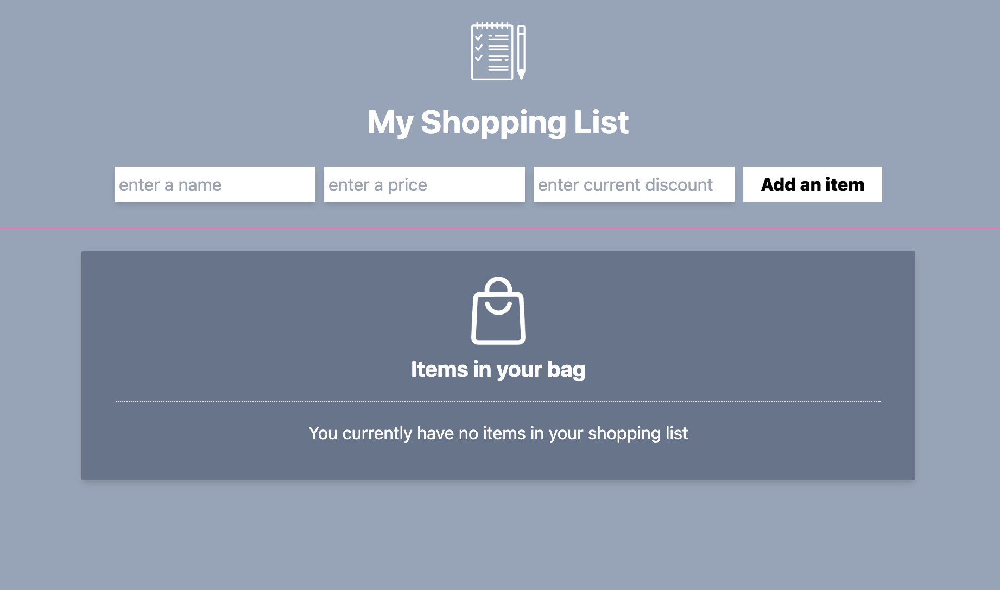
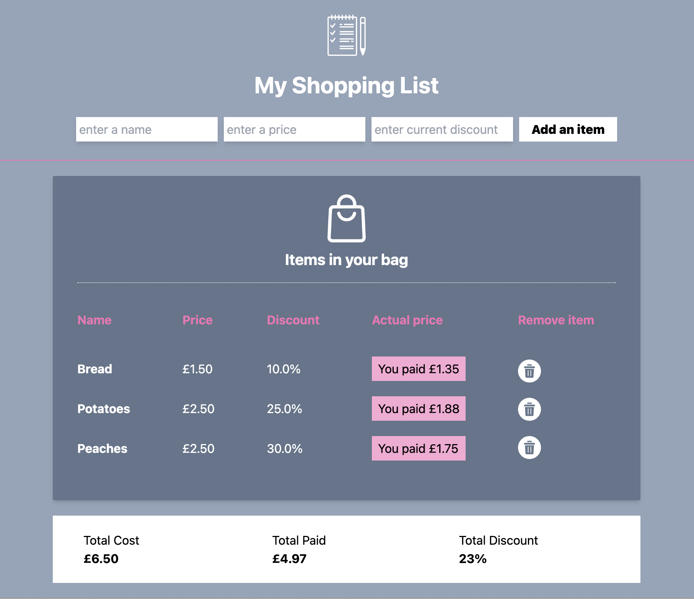

A shopping list which allows the user to enter items into a form, as well as price and discount which then display underneath as a shopping list. 
It calculates the total price, total paid and total discount received. The items are saved into a mysql database.

The app uses Python and Flask, as well as Tailwind CSS for styling.

To run, clone repo locally, create a local database with the name "new_db" and run the provided sql queries . 

Install requirements and execute:
flask --app main --debug run
or
python main.py

